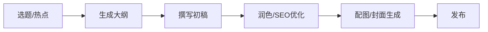

# Content Creation Skill Pack

**内容创作与自媒体助手技能包 (待扩充)**

---

## 📖 简介 (Introduction)

本技能包旨在辅助 **内容创作者、自媒体运营者和市场营销人员**。它可以帮助你生成文章大纲、优化 SEO、撰写社交媒体文案、设计封面提示词等。

## 🧩 包含的 Skill (Included Skills)

本技能包包含以下核心 Skill，位于 `skills/` 目录下：

### 视觉与图像
- **`image-assistant` (配图助手)**
  - **角色定义**: 专注于将文章/模块内容转化为高质量的配图提示词。
  - **核心能力**: 
    - 自动提取关键信息并设计 16:9 信息图。
    - 生成风格统一的 Midjourney/Stable Diffusion 提示词。
    - 支持多种视觉模板（漫画、对比图、路线图等）。

- **`infographic` (信息图设计)**
  - **角色定义**: 专业的信息可视化设计师。
  - **核心能力**: 将复杂数据或概念转化为直观的信息图表设计方案。

- **`manhua-assistant` (漫画创作助手)**
  - **角色定义**: 漫画脚本与分镜设计师。
  - **核心能力**: 
    - 辅助创作连环画或叙事性漫画。
    - 提供分镜描述和画面构图建议。

### 内容挖掘
- **`thought-mining` (思维挖掘)**
  - **角色定义**: 你的灵感捕手和写作教练。
  - **核心能力**: 
    - 通过对话挖掘你脑海中零散的想法。
    - 将碎片化思维整理成结构化的文章大纲。
    - 辅助完成从灵感到成稿的全过程。

## 🛠 使用指南 (Usage Guide)

1.  **文章配图**:
    - "把这段文字转成一张 16:9 的信息图提示词。" -> 激活 `image-assistant`。

2.  **灵感整理**:
    - "我有一个关于 AI 甚至的模糊想法，帮我理一理。" -> 激活 `thought-mining`。

## 🗺 创作工作流示例 (Example Workflow)

