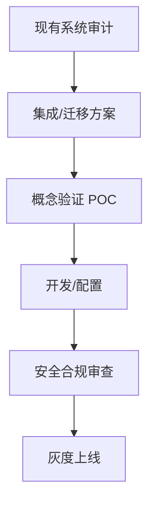

# Enterprise Integration Skill Pack

**企业级集成与解决方案技能包 (待扩充)**

---

## 📖 简介 (Introduction)

本技能包专注于 **企业级软件集成、遗留系统改造和复杂的业务解决方案**。它适用于处理大规模系统、ERP/CRM 集成、云服务迁移等高复杂度场景。

> ⚠️ **注意**: 目前本目录为空，作为预留的分类容器。你可以从其他开源 Skill 库中寻找相关技能并添加至此。

## 🧩 推荐添加的 Skill 类型 (Recommended Skills)

建议你寻找或创建以下类型的 Skill 放入 `skills/` 目录：

1.  **Cloud Migration Expert**: AWS/Azure/GCP 迁移策略与 Terraform 编写。
2.  **Legacy Code Refactoring**: COBOL/JavaEE 遗留代码分析与重构指南。
3.  **Security Auditor**: 企业级安全合规检查（GDPR, SOC2）与代码漏洞扫描。
4.  **Microservices Patterns**: 微服务拆分、服务网格 (Istio) 配置与分布式事务处理。

## 🛠 如何扩展 (How to Extend)

1.  在 `skills/` 目录下创建一个新文件夹，例如 `skills/09_Enterprise_Security/`。
2.  在该文件夹中创建一个 `SKILL.md` 文件，定义 AI 的角色和规则。
3.  添加必要的参考资料（如安全合规清单、架构决策记录模板等）。

## 🗺 集成工作流示例 (Example Workflow)

