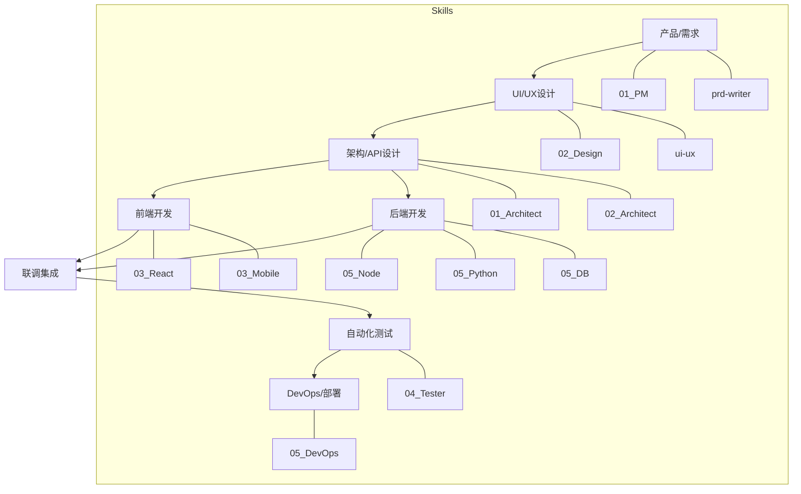

# FullStack Engineering Skill Pack

**全栈研发核心技能包：从架构到部署**

---

## 📖 简介 (Introduction)

这是最全面、最核心的技能包，涵盖了软件研发生命周期的 **架构设计、前端开发、后端开发、测试验证、DevOps 运维** 等所有环节。无论你是构建 Web 应用、移动 App 还是后端服务，这里都有对应的专家 Skill。

## 🧩 包含的 Skill (Included Skills)

本技能包包含以下核心 Skill，位于 `skills/` 目录下：

### 🏗️ 架构与选型
- **`01_Architect_TechStackSelector`**: 技术栈选型顾问，根据需求推荐最合适的技术组合。
- **`01_Discovery_GitHubSearch`**: 开源项目调研助手，快速寻找参考实现。
- **`02_Architect_APIDesign`**: API 设计专家，制定 RESTful/GraphQL 接口规范。

### 💻 前端与移动端
- **`02_Designer_FrontendImplementation`**: 前端 UI 还原专家，将设计稿转为代码。
- **`frontend-design`**: 创意型前端设计，专注于生成高设计感的 Web 组件与页面。
- **`03_Developer_ReactBestPractices`**: React/Next.js 性能与规范专家。
- **`03_Developer_ArtifactsBuilder`**: 前端组件与页面生成工具。
- **`03_Mobile_Flutter`**: Flutter 移动端开发专家。

### ⚙️ 后端与服务
- **`05_Backend_Node`**: Node.js 后端开发专家。
- **`05_Backend_Python`**: Python/FastAPI 后端开发专家。
- **`05_Backend_Database`**: 数据库设计与 SQL 优化专家。
- **`05_Backend_MCPBuilder`**: MCP (Model Context Protocol) 服务开发专家。

### 🧪 测试与流程
- **`req-change-workflow`**: 需求变更标准化工作流，处理代码修改、重构与回归测试。
- **`04_Tester_BrowserAutomation`**: 自动化测试专家 (Playwright/Selenium)。
- **`05_DevOps_GitWorkflow`**: Git 工作流规范顾问。
- **`05_DevOps_GitOps`**: Kubernetes 与 CI/CD 部署专家。

## 🛠 使用指南 (Usage Guide)

本技能包是一个**全能工具箱**。你可以根据当前的工作阶段，唤醒特定的专家。

### 场景示例

1.  **新项目启动**:
    - "我想做一个博客系统，帮我推荐技术栈。" -> 唤醒 `TechStackSelector`。
    - "设计一下文章发布的 API 接口。" -> 唤醒 `APIDesign`。

2.  **功能开发**:
    - "用 React 和 Tailwind 实现这个登录页面，注意性能。" -> 唤醒 `ReactBestPractices`。
    - "帮我写一个 Python 接口来处理图片上传。" -> 唤醒 `Backend_Python`。

3.  **质量保证**:
    - "帮我写一个自动化测试脚本，测试登录流程。" -> 唤醒 `Tester_BrowserAutomation`。

## 🗺 研发全流程 (Development Lifecycle)

