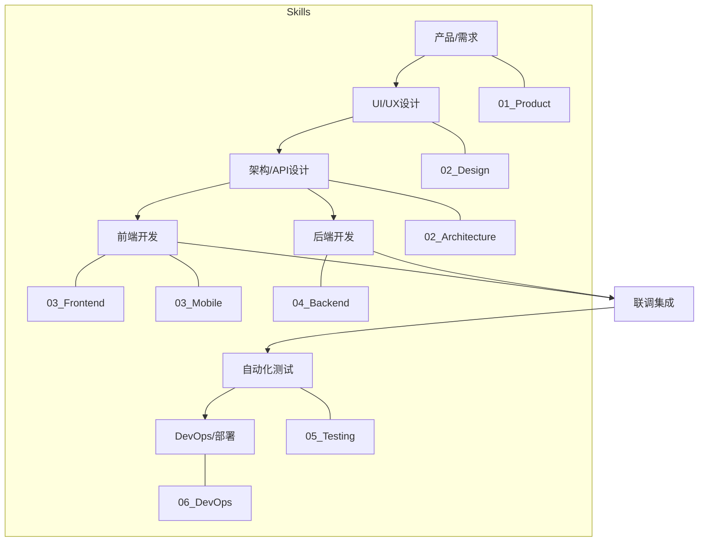

# FullStack Engineering Skill Pack

**全栈研发核心技能包：从架构到部署**

---

## 📖 简介 (Introduction)

这是最全面、最核心的技能包，涵盖了软件研发生命周期的 **产品探索、架构设计、前端开发、后端开发、测试验证、DevOps 运维** 等所有环节。无论你是构建 Web 应用、移动 App 还是后端服务，这里都有对应的专家 Skill。

## 🧩 包含的 Skill (Included Skills)

本技能包包含以下核心 Skill，位于 `skills/` 目录下，按功能模块和流程顺序分类：

### 01 Product & Discovery (产品与探索)
- **`01_Product_Brainstorming`**: 产品头脑风暴助手，激发创意。
- **`01_Product_GitHubSearch`**: 开源项目调研助手，快速寻找参考实现。
- **`01_Product_PRDWriter`**: PRD 文档撰写专家，支持 Mermaid 图表生成 (原 prd-doc-writer)。

### 02 Architecture & Design (架构与设计)
- **`02_Architecture_TechStackSelector`**: 技术栈选型顾问，根据需求推荐最合适的技术组合。
- **`02_Architecture_APIDesign`**: API 设计专家，制定 RESTful/GraphQL 接口规范。
- **`02_Design_BrandGuidelines`**: 品牌设计指南生成。
- **`02_Design_CanvasDesign`**: 画布设计工具。
- **`02_Design_WebGuidelines`**: Web 设计规范。
- **`02_Design_UIUXIntelligence`**: UI/UX 智能设计助手。
- **`02_Design_UIUXProMax`**: 高级 UI/UX 设计专家 (原 ui-ux-pro-max)。

### 03 Frontend & Mobile (前端与移动端)
- **`03_Frontend_Implementation`**: 前端 UI 还原专家，将设计稿转为代码。
- **`03_Frontend_Design`**: 创意型前端设计 (原 frontend-design)。
- **`03_Frontend_ArtifactsBuilder`**: 前端组件与页面生成工具。
- **`03_Frontend_CompositionPatterns`**: 前端组合模式与最佳实践。
- **`03_Frontend_ReactBestPractices`**: React/Next.js 性能与规范专家。
- **`03_Mobile_Flutter`**: Flutter 移动端开发专家。
- **`03_Mobile_ReactNative`**: React Native 移动端开发专家。

### 04 Backend & Database (后端与数据库)
- **`04_Backend_Node`**: Node.js 后端开发专家。
- **`04_Backend_Python`**: Python/FastAPI 后端开发专家。
- **`04_Backend_Database`**: 数据库设计与 SQL 优化专家。
- **`04_Backend_MCPBuilder`**: MCP (Model Context Protocol) 服务开发专家。

### 05 Testing & QA (测试与质量)
- **`05_Testing_BrowserAutomation`**: 自动化测试专家 (Playwright/Selenium)。
- **`05_Testing_WebAppTesting`**: Web 应用测试专家。
- **`05_Testing_ReqChangeWorkflow`**: 需求变更标准化工作流 (原 req-change-workflow)。

### 06 DevOps & Deployment (运维与部署)
- **`06_DevOps_GitWorkflow`**: Git 工作流规范顾问。
- **`06_DevOps_GitOps`**: Kubernetes 与 CI/CD 部署专家。
- **`06_DevOps_CircleCI`**: CircleCI 配置专家。
- **`06_DevOps_Datadog`**: Datadog 监控配置。
- **`06_DevOps_VercelDeploy`**: Vercel 部署助手。
- **`06_DevOps_ChangelogGenerator`**: 变更日志生成器。
- **`06_DevOps_GiteeWorkflow`**: Gitee 工作流。
- **`06_DevOps_DeveloperGrowth`**: 开发者成长与文化。

## 🛠 使用指南 (Usage Guide)

本技能包是一个**全能工具箱**。你可以根据当前的工作阶段，唤醒特定的专家。

### 场景示例

1.  **新项目启动**:
    - "我想做一个博客系统，帮我推荐技术栈。" -> 唤醒 `02_Architecture_TechStackSelector`。
    - "设计一下文章发布的 API 接口。" -> 唤醒 `02_Architecture_APIDesign`。

2.  **功能开发**:
    - "用 React 和 Tailwind 实现这个登录页面，注意性能。" -> 唤醒 `03_Frontend_ReactBestPractices`。
    - "帮我写一个 Python 接口来处理图片上传。" -> 唤醒 `04_Backend_Python`。

3.  **质量保证**:
    - "帮我写一个自动化测试脚本，测试登录流程。" -> 唤醒 `05_Testing_BrowserAutomation`。

## 🗺 研发全流程 (Development Lifecycle)

